# 📝 协作指南  
**最后更新**：2025-03-25  

---

## 一、环境准备  
### 1. 克隆仓库（含子模块）  
```bash
git clone --recursive https://github.com/Yokumii/Data-Structure-Course-Design-Docs.git
cd Data-Structure-Course-Design-Docs
```

### 2. 文档专用环境  
```bash
# 安装依赖（Python 3.9+ required）
pip install mkdocs-material mkdocs-redirects
```

---

## 二、日常协作流程  
### ▶ 修改文档内容  

```mermaid
graph LR
    A[创建分支] --> B[编辑文档] --> C[本地预览] --> D[提交PR]
```


#### 1. 创建特性分支  
```bash
git checkout -b docs/你的功能名  # 示例：docs/add-api-spec
```

#### 2. 启动实时预览  
```bash
mkdocs serve
# 浏览器访问 http://localhost:8000
```

#### 3. 提交变更  
```bash
# 添加文件
git add docs/requirements/feature.md

# 标准化提交消息
git commit -m "docs(requirements): 更新功能需求文档"

# 推送到远程
git push origin docs/你的功能名
```

#### 4. 创建Pull Request  
1. 访问仓库 → **Pull Requests** → **New PR**  
2. 选择 `base: main` ← `compare: docs/你的功能名`  
3. 添加Reviewers：@Yokumii @其他成员  

---

## 三、文档规范  
### 1. 文件命名  
| 类型       | 格式                | 示例                  |
|------------|---------------------|-----------------------|
| 普通文档   | `小写_下划线.md`    | `feature_flow.md`     |
| API文档    | `动词_资源.md`      | `get_attractions.md`  |

### 2. Markdown语法标准  
````markdown
## 二级标题（左对齐）

**重点内容** 使用加粗强调

```python
# 代码块必须指定语言
def example():
    return "Hello"
```

> 注意事项使用引用块
````

### 3. 图片管理  
- 存放路径：`docs/images/`  
- 命名规则：`功能_序号.png`（如 `login_01.png`）  

---

## 四、紧急情况处理  
### 1. 文档回滚  
```bash
# 查找历史版本
git log --oneline -- docs/

# 恢复单个文件
git checkout 提交ID -- docs/requirements/feature.md
```

### 2. 解决冲突  
```bash
# 拉取最新main分支
git fetch origin main

# 合并最新代码
git rebase origin/main

# 手动解决冲突后
git add .
git rebase --continue
```

---

## 五、常用命令速查  
| 场景               | 命令                                                                 |
|--------------------|----------------------------------------------------------------------|
| 更新子模块         | `git submodule update --remote`                                     |
| 构建静态网站       | `mkdocs build --clean`                                              |
| 检查死链           | `mkdocs build --strict`                                             |
| 生成PDF            | `pandoc docs/index.md -o output.pdf --template=eisvogel --pdf-engine=xelatex` |

---