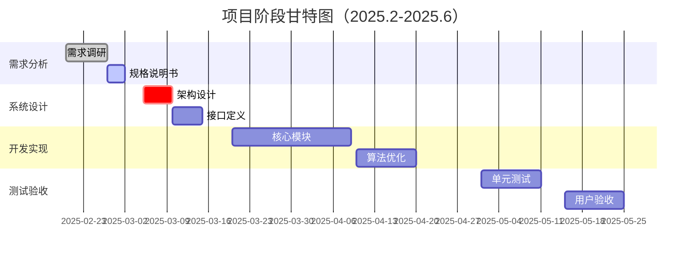

# 🗓️ 个性化旅游系统项目计划书
**北京邮电大学数据结构课程设计**  
**指导教师：杨震**  
**团队成员**：张珂铭、王天翼、姬梦圆 

---

## 一、项目阶段划分


---

## 二、详细任务分解

### 1. 需求分析阶段（2025.2.20-2.28）
**交付物**：  
- `需求规格说明书.doc`（含以下内容）  
  - 功能需求（基于`docs/requirements/features.md`扩展）  
  - 数据字典（参考`docs/requirements/data.md`规范）  
  - 用例图（使用PlantUML绘制）  

**具体任务**：  
| 任务 | 负责人 | 验收标准 | 关联文档 |
|------|--------|----------|----------|
| 景点数据采集 | 姓名2 | ≥200条结构化数据 | attractions.csv |

---

### 2. 系统设计阶段（2025.3.1-3.15）
**交付物**：  
- `系统设计说明书.doc`  
- `数据库ER图.pdf`  
- `API接口文档.md`（基于现有`docs/api/backend.md`）  

**关键设计任务**：  
1. **数据结构设计**
   ```c
   // 景点图的邻接表表示
   typedef struct AttractionNode {
       int id;
       char name[100];
       struct EdgeNode *first_edge;
   } Attraction;
   ```

2. **模块划分**
   | 模块 | 技术方案 | 负责成员 |
   |------|----------|----------|
   | 路径规划 | Dijkstra算法 | 姓名1 |
   | 推荐系统 | 加权排序算法 | 姓名2 |

---

### 3. 编码实现阶段（2025.3.16-4.30）
**里程碑计划**：  
| 周次 | 实现功能 | 代码提交要求 |
|------|----------|--------------|
| 第5周 | 用户认证模块 | 包含JWT实现 |
| 第7周 | 景点数据管理 | 实现CSV导入 |
| 第9周 | 路径规划功能 | 通过5组测试用例 |
| 第11周 | 推荐算法 | 性能分析报告 |

**代码规范**：  
- 前端：遵循`frontend/README.md`中的Dart规范  
- 后端：PEP8规范，函数需有Google风格注释  
   ```python
   def dijkstra(graph, start):
       """计算最短路径
       Args:
           graph: 邻接表表示的图
           start: 起始节点ID
       Returns:
           dict: {节点ID: 最短距离}
       """
   ```

---

### 4. 测试阶段（2025.5.1-5.25）
**测试要求**：  
1. **单元测试**  
   - 覆盖率≥80%（使用pytest-cov）  
   - 测试用例模板：  
     ```python
     def test_shortest_path():
         graph = build_test_graph()  # 使用课程要求的200+节点数据
         assert dijkstra(graph, 1)[100] == 3500  # 预期最短距离
     ```

2. **压力测试**  

---

### 5. 最终交付（2025.6.1前）
**提交材料清单**：  
1. **电子版**（教学云平台提交）  
   - 报告文档：`学号1_学号2_学号3/report.doc`  
   - 可执行程序：`run.exe` 或 `app.jar`  
   - 源代码：按`frontend/`和`backend/`分类压缩  
   - 文档集：包含所有`docs/`下的Markdown文件  
  
---

## 三、质量保障措施
1. **代码审查**  
   - 每周三下午进行GitHub PR Review  
   - 必须通过ESLint（前端）和pylint（后端）检查  

2. **文档同步**  
   - 使用MkDocs自动构建文档站点  
   - 每次API变更需更新`docs/api/`下的对应文件  

3. **进度监控**  
   ```bash
   # 每周生成项目进度报告
   python scripts/report.py --week 5 --output progress_week5.md
   ```

---