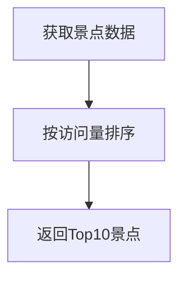

# 功能需求说明

## 1. 旅游推荐系统
### 1.1 基于热度的推荐


### 1.2 基于评分的推荐
| 算法 | 时间复杂度 | 适用场景 |
|------|------------|----------|
| 加权平均 | O(n)       | 普通用户 |
| 贝叶斯平均 | O(n)      | 新景点 |

## 2. 路径规划系统
### 2.1 最短路径算法
```python
def dijkstra(graph, start):
    # 实现代码示例
    pass
```

## 3. 数据要求
- 景点数量 ≥ 200个
- 道路连接 ≥ 200条